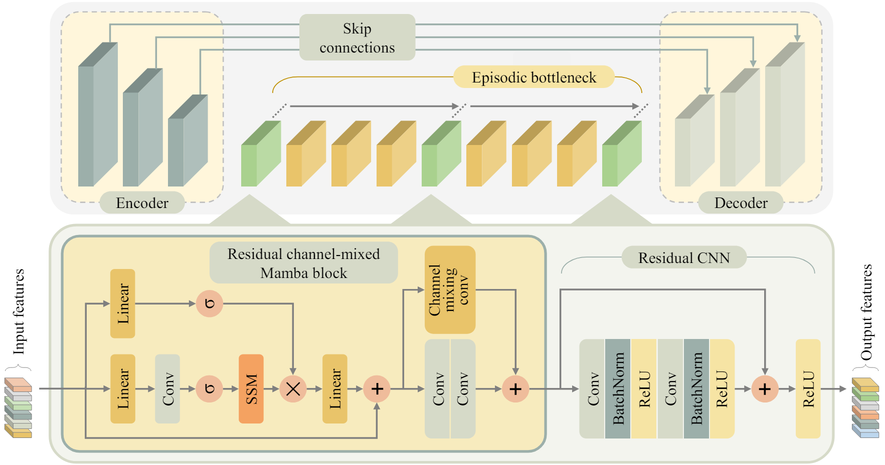

<hr>
<h1 align="center">
  I2I-Mamba <br>
  <sub>Multi-modal medical image synthesis via selective state space modeling</sub>
</h1>

<div align="center">
  <a href="https://github.com/OmerFarukAtli" target="_blank">Omer F.&nbsp;Atli</a><sup>1,2</sup> &ensp; <b>&middot;</b> &ensp;
  <a href="https://bilalkabas.github.io/" target="_blank">Bilal&nbsp;Kabas</a><sup>1,2</sup> &ensp; <b>&middot;</b> &ensp;
  <a href="https://github.com/fuat-arslan" target="_blank">Fuat&nbsp;Arslan</a><sup>1,2</sup> &ensp; <b>&middot;</b> &ensp;
  <a target="_blank">Arda C.&nbsp;Demirtas</a><sup>1,2</sup> &ensp; <b>&middot;</b> &ensp;
  <a href="https://scholar.google.com.tr/citations?user=oAXHlRMAAAAJ&hl=en" target="_blank">Mahmut&nbsp;Yurt</a><sup>3</sup> &ensp; <b>&middot;</b> &ensp;
  <a href="https://onatdalmaz.com/" target="_blank">Onat&nbsp;Dalmaz</a><sup>3</sup> &ensp; <b>&middot;</b> &ensp;
  <a href="https://kilyos.ee.bilkent.edu.tr/~cukur/" target="_blank">Tolga&nbsp;Çukur</a><sup>1,2</sup> &ensp;
  
  <span></span>
  
  <sup>1</sup>Bilkent University &emsp; <sup>2</sup>UMRAM &emsp; <sup>3</sup>Stanford University <br>
</div>
<hr>

<h3 align="center">[<a href="https://arxiv.org/abs/2405.14022">arXiv</a>]</h3>

Official PyTorch implementation of **I2I-Mamba**, a novel adversarial model for multi-modal medical image synthesis that leverages selective state space modeling (SSM) to efficiently capture long-range context while maintaining local precision. I2I-Mamba injects channel-mixed Mamba (cmMamba) blocks in the bottleneck of a convolutional backbone. In cmMamba blocks, SSM layers are used to learn context across the spatial dimension and channel-mixing layers are used to learn context across the channel dimension of feature maps.





## Dependencies

```
python>=3.8.13
cuda=>11.6

torch>=2.2
torchvision>=0.17
visdom
dominate
scikit-image
h5py
scipy
ml_collections
mamba-ssm==1.1.3
```
You are welcome to ask any library issues.

## Dataset
To reproduce the results reported in the paper, we recommend the following dataset processing steps:

Sequentially select subjects from the dataset.
Apply skull-stripping to 3D volumes.
Select 2D cross-sections from each subject.
Normalize the selected 2D cross-sections before training and before metric calculation.

You should structure your aligned dataset in the following way:

```
/datasets/IXI/
  ├── T1_T2
  │   ├── train
  |    - 1.png
  |    - 2.png
  |    - ...
  │   ├── val
  │   └── test
  ├── T2_PD
  │   ├── train
  │   └── ...
  ├── T1_PD__T2
  │   ├── train
  │   └── ...
  
```

x.png is a single image containing both source and target image side-by-side. Thus the resulting image for one-to-one task will be 512 pixels horizontally and 256 pixels vertically and for many-to-one task it will be 768 pixels horizontally and 256 pixels vertically.

Note that for many-to-one tasks, source modalities should be in the Red and Green channels.

You may use data_preparetion. 
For one to one task, change first image path, second image path and output path, then run dataprep_one_to_one.py, which is under data_preparation folder. The same slice should have same namings in their corresponding folders. If you want to prepare A__B the first image path will be path for A and second image path will be path for B.

```
python3 dataprep_one_to_one.py
```

For many to one task, change first image path, second image path, third image path and output path, then run dataprep_many_to_one.py, which is under data_preparation folder. The same slice should have same namings in their corresponding folders. If you want to prepare A_B__C the first image path will be path for A and second image path will be path for B and the third image path will be C.  

```
python3 dataprep_many_to_one.py
```

## Training
### Step 0
Before training your data you are required to run path_generate.py to generate 'spiral_eye.npy', 'spiral_r_eye_.npy', 'despiral_r_eye_.npy' which are required for training and testing. Note that this file will be run only for the first time.
```
python3 models/path_generate.py
```
### Commands

1. One-to-one training, e.g. T2->PD

```
python3 train.py --dataroot datasets/IXI/T2_PD/ --name ixi_t2__pd --gpu_ids 0 --model i2i_mamba_one --which_model_netG i2i_mamba --which_direction AtoB --lambda_A 100 --dataset_mode aligned --norm batch --pool_size 0 --output_nc 1 --input_nc 1 --loadSize 256 --fineSize 256 --niter 30 --niter_decay 30 --save_epoch_freq 5 --checkpoints_dir checkpoints/ --display_id 0 --lr 0.0001
```

2. Many-to-one training, e.g. T1,T2->PD

```
python3 train.py --dataroot datasets/IXI/T1_T2__PD/ --name ixi_t1_t2__pd --gpu_ids 0 --model i2i_mamba_many --which_model_netG i2i_mamba --which_direction AtoB --lambda_A 100 --dataset_mode aligned --norm batch --pool_size 0 --output_nc 1 --input_nc 3 --loadSize 256 --fineSize 256 --niter 30 --niter_decay 30 --save_epoch_freq 5 --checkpoints_dir checkpoints/ --display_id 0 --lr 0.0001
```

### Argument descriptions

| Argument            | Description                                                                 |
|---------------------|-----------------------------------------------------------------------------|
| `--dataroot`        | Root directory path of the dataset.                                         |
| `--name`            | Name of the experiment, used for storing model checkpoints and results.     |
| `--gpu_ids`         | List of GPU IDs to use for training (e.g., 0 for the first GPU).            |
| `--model`           | Model type to use for training.                                             |
| `--which_model_netG`| Specifies the generator architecture to use.                                |
| `--which_direction` | Direction of the image translation, e.g., AtoB or BtoA.                     |
| `--lambda_A`        | Weight for cycle consistency loss from domain A to B and back to A.         |
| `--dataset_mode`    | Dataset loading mode, specifying how the dataset is loaded (e.g., aligned). |
| `--norm`            | Normalization type used in the model, e.g., batch normalization.            |
| `--pool_size`       | Size of the image buffer that stores previously generated images.           |
| `--output_nc`       | Number of output image channels.                                            |
| `--input_nc`        | Number of input image channels.                                             |
| `--loadSize`        | Scale images to this size before cropping.                                  |
| `--fineSize`        | Crop images to this size for training.                                      |
| `--niter`           | Number of iterations with the initial learning rate.                        |
| `--niter_decay`     | Number of iterations to linearly decay the learning rate to zero.           |
| `--save_epoch_freq` | Frequency of saving checkpoints at the end of epochs.                       |
| `--checkpoints_dir` | Directory where model checkpoints are saved.                                |
| `--display_id`      | ID of the display window for visualizing training results (0 to disable).   |
| `--lr`              | Initial learning rate for the optimizer.                                    |


## Testing

### Commands
1. One-to-one testing, e.g. T2->PD

```
python3 test.py --dataroot datasets/IXI/T2_PD/ --name ixi_t2__pd --gpu_ids 0 --model i2i_mamba_one --which_model_netG i2i_mamba --dataset_mode aligned --norm batch --phase test --output_nc 1 --input_nc 1 --how_many 10000 --serial_batches --fineSize 256 --loadSize 256 --results_dir results/ --checkpoints_dir checkpoints/ --which_epoch 60
```

2. Many-to-one testing, e.g. T1,T2->PD

```
python3 test.py --dataroot datasets/IXI/T1_T2__PD/ --name T2_PD_T1_mambaoffTekrar_nonorm --gpu_ids 0 --model i2i_mamba_many --which_model_netG i2i_mamba --dataset_mode aligned --norm batch --phase test --output_nc 1 --input_nc 3 --how_many 10000 --serial_batches --fineSize 256 --loadSize 256 --results_dir results/ --checkpoints_dir checkpoints/ --which_epoch 60
```

### Argument descriptions

| Argument            | Description                                                                 |
|---------------------|-----------------------------------------------------------------------------|
| `--results_dir`     | Directory where test results are saved.                                     |
| `--serial_batches`  | If set, takes images in order to make batches, otherwise takes them randomly.|
| `--how_many`        | Number of test images to run.                                               |
| `--which_epoch`     | Which epoch to load? Set to 'latest' to use the latest cached model.        |

## Citation
You are encouraged to modify/distribute this code. However, please acknowledge this code and cite the paper appropriately.
```
@article{atli2024i2imamba,
  title={I2I-Mamba: Multi-modal medical image synthesis via selective state space modeling}, 
  author={Omer F. Atli and Bilal Kabas and Fuat Arslan and Mahmut Yurt and Onat Dalmaz and Tolga Çukur},
  year={2024},
  journal={arXiv:2405.14022}
}
```
For any questions, comments and contributions, please feel free to contact Omer Faruk Atli (faruk.atli[at]bilkent.edu.tr)

## Acknowledgments

This code uses libraries from [ResViT](https://github.com/icon-lab/ResViT) and [mamba](https://github.com/state-spaces/mamba) repository.

<hr>

Copyright © 2024, ICON Lab.
